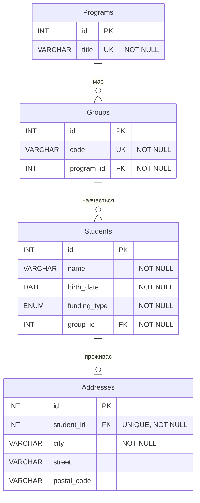

# 🏗️ Структура бази даних

Детальний опис структури бази даних системи обліку студентів.

## 📑 Зміст

- [ER-діаграма](#er-діаграма)
- [Таблиці](#таблиці)
- [Зв'язки між таблицями](#звязки-між-таблицями)
- [Індекси та обмеження](#індекси-та-обмеження)

---

## ER-діаграма

### Текстове представлення

```
┌─────────────────┐
│    Programs     │
│─────────────────│
│ PK  id          │
│     title (U)   │
└─────────────────┘
        │
        │ 1:N
        ↓
┌─────────────────┐
│     Groups      │
│─────────────────│
│ PK  id          │
│     code (U)    │
│ FK  program_id  │
└─────────────────┘
        │
        │ 1:N
        ↓
┌─────────────────┐
│    Students     │
│─────────────────│
│ PK  id          │
│     name        │
│     birth_date  │
│     funding_type│
│ FK  group_id    │
└─────────────────┘
        │
        │ 1:1
        ↓
┌─────────────────┐
│   Addresses     │
│─────────────────│
│ PK  id          │
│ FK  student_id  │
│     city        │
│     street      │
│     postal_code │
└─────────────────┘
```

### Mermaid діаграма



---

## Таблиці

### 1. Programs (Програми)

**Призначення:** Зберігає інформацію про освітні програми навчального закладу.

**SQL створення:**
```sql
CREATE TABLE Programs (
    id INT PRIMARY KEY AUTO_INCREMENT,
    title VARCHAR(255) NOT NULL CHECK (CHAR_LENGTH(title) >= 3),
    UNIQUE KEY unique_title (title)
) ENGINE=InnoDB DEFAULT CHARSET=utf8mb4;
```

**Опис полів:**

| Поле | Тип | Обмеження | Опис |
|------|-----|-----------|------|
| `id` | INT | PRIMARY KEY, AUTO_INCREMENT | Унікальний ідентифікатор програми |
| `title` | VARCHAR(255) | NOT NULL, UNIQUE, CHECK (>= 3 символи) | Назва програми навчання |

**Обмеження:**
- ✅ **NOT NULL**: Назва програми обов'язкова
- ✅ **UNIQUE**: Назва програми має бути унікальною
- ✅ **CHECK**: Мінімальна довжина назви - 3 символи
- ✅ **AUTO_INCREMENT**: Автоматична генерація ID

**Приклади даних:**
```sql
+----+---------------------+
| id | title               |
+----+---------------------+
|  1 | Кібербезпека        |
|  2 | Інженерія ПЗ        |
|  3 | Комп'ютерні науки   |
+----+---------------------+
```

---

### 2. Groups (Групи)

**Призначення:** Зберігає інформацію про навчальні групи з прив'язкою до програм.

**SQL створення:**
```sql
CREATE TABLE `Groups` (
    id INT PRIMARY KEY AUTO_INCREMENT,
    code VARCHAR(50) NOT NULL CHECK (code REGEXP '^[A-Z]{2,4}-[0-9]{2}-[0-9]+$'),
    program_id INT NOT NULL,
    UNIQUE KEY unique_code (code),
    FOREIGN KEY (program_id) REFERENCES Programs(id) ON DELETE CASCADE ON UPDATE CASCADE,
    INDEX idx_program (program_id)
) ENGINE=InnoDB DEFAULT CHARSET=utf8mb4;
```

⚠️ **Важливо:** Таблиця `Groups` береться в зворотні лапки (`) тому що це зарезервоване слово в MySQL.

**Опис полів:**

| Поле | Тип | Обмеження | Опис |
|------|-----|-----------|------|
| `id` | INT | PRIMARY KEY, AUTO_INCREMENT | Унікальний ідентифікатор групи |
| `code` | VARCHAR(50) | NOT NULL, UNIQUE, CHECK (REGEXP) | Код групи у форматі XX-YY-Z |
| `program_id` | INT | NOT NULL, FOREIGN KEY | Зовнішній ключ до таблиці Programs |

**Формат коду групи:**
- Формат: `[A-Z]{2,4}-[0-9]{2}-[0-9]+`
- Приклади: `KB-25-1`, `IPZ-25-1`, `CS-25-1`, `CSAI-24-2`
- Структура:
  - **Перша частина**: 2-4 великі латинські літери (абревіатура програми)
  - **Друга частина**: 2 цифри (рік вступу)
  - **Третя частина**: номер групи (1 або більше цифр)

**Обмеження:**
- ✅ **NOT NULL**: Код групи обов'язковий
- ✅ **UNIQUE**: Код групи має бути унікальним
- ✅ **CHECK (REGEXP)**: Перевірка формату коду
- ✅ **FOREIGN KEY**: Зв'язок з таблицею Programs
- ✅ **ON DELETE CASCADE**: При видаленні програми видаляються всі її групи
- ✅ **ON UPDATE CASCADE**: При зміні ID програми оновлюється program_id

**Приклади даних:**
```sql
+----+---------+------------+
| id | code    | program_id |
+----+---------+------------+
|  1 | KB-25-1 |          1 |
|  2 | IPZ-25-1|          2 |
|  3 | CS-25-1 |          3 |
+----+---------+------------+
```

---

### 3. Students (Студенти)

**Призначення:** Зберігає основну інформацію про студентів.

**SQL створення:**
```sql
CREATE TABLE Students (
    id INT PRIMARY KEY AUTO_INCREMENT,
    name VARCHAR(255) NOT NULL CHECK (CHAR_LENGTH(name) >= 5),
    birth_date DATE NOT NULL CHECK (birth_date BETWEEN '1990-01-01' AND CURDATE()),
    funding_type ENUM('state', 'contract') NOT NULL,
    group_id INT NOT NULL,
    FOREIGN KEY (group_id) REFERENCES `Groups`(id) ON DELETE RESTRICT ON UPDATE CASCADE,
    INDEX idx_group (group_id),
    INDEX idx_funding (funding_type)
) ENGINE=InnoDB DEFAULT CHARSET=utf8mb4;
```

**Опис полів:**

| Поле | Тип | Обмеження | Опис |
|------|-----|-----------|------|
| `id` | INT | PRIMARY KEY, AUTO_INCREMENT | Унікальний ідентифікатор студента |
| `name` | VARCHAR(255) | NOT NULL, CHECK (>= 5 символів) | ПІБ студента |
| `birth_date` | DATE | NOT NULL, CHECK (1990-01-01 до сьогодні) | Дата народження |
| `funding_type` | ENUM('state', 'contract') | NOT NULL | Тип фінансування |
| `group_id` | INT | NOT NULL, FOREIGN KEY | Зовнішній ключ до таблиці Groups |

**Типи фінансування:**
- `state` - Державне фінансування (бюджет)
- `contract` - Контрактне навчання (платне)

**Обмеження:**
- ✅ **NOT NULL**: Всі поля обов'язкові
- ✅ **CHECK (name)**: Мінімальна довжина імені - 5 символів
- ✅ **CHECK (birth_date)**: Дата народження від 01.01.1990 до поточної дати
- ✅ **ENUM**: Тип фінансування тільки 'state' або 'contract'
- ✅ **FOREIGN KEY**: Зв'язок з таблицею Groups
- ✅ **ON DELETE RESTRICT**: Не можна видалити групу, якщо в ній є студенти
- ✅ **INDEX**: Індекси для швидкого пошуку по групі та типу фінансування

**Приклади даних:**
```sql
+----+------------------+------------+--------------+----------+
| id | name             | birth_date | funding_type | group_id |
+----+------------------+------------+--------------+----------+
|  1 | Анна Коваль      | 2007-03-14 | contract     |        1 |
|  2 | Іван Петренко    | 2006-11-02 | state        |        1 |
|  3 | Марія Бондар     | 2007-08-22 | state        |        2 |
|  4 | Олег Сидоренко   | 2006-01-30 | contract     |        2 |
|  5 | Петро Шевченко   | 2007-05-18 | state        |        3 |
+----+------------------+------------+--------------+----------+
```

---

### 4. Addresses (Адреси)

**Призначення:** Зберігає адресну інформацію студентів (зв'язок 1:1).

**SQL створення:**
```sql
CREATE TABLE Addresses (
    id INT PRIMARY KEY AUTO_INCREMENT,
    student_id INT NOT NULL UNIQUE,
    city VARCHAR(100) NOT NULL CHECK (CHAR_LENGTH(city) >= 2),
    street VARCHAR(255) DEFAULT NULL,
    postal_code VARCHAR(10) DEFAULT NULL CHECK (postal_code IS NULL OR postal_code REGEXP '^[0-9]{5}$'),
    FOREIGN KEY (student_id) REFERENCES Students(id) ON DELETE CASCADE ON UPDATE CASCADE
) ENGINE=InnoDB DEFAULT CHARSET=utf8mb4;
```

**Опис полів:**

| Поле | Тип | Обмеження | Опис |
|------|-----|-----------|------|
| `id` | INT | PRIMARY KEY, AUTO_INCREMENT | Унікальний ідентифікатор адреси |
| `student_id` | INT | NOT NULL, UNIQUE, FOREIGN KEY | Зовнішній ключ до таблиці Students |
| `city` | VARCHAR(100) | NOT NULL, CHECK (>= 2 символи) | Місто проживання |
| `street` | VARCHAR(255) | DEFAULT NULL | Вулиця та номер будинку |
| `postal_code` | VARCHAR(10) | DEFAULT NULL, CHECK (REGEXP) | Поштовий індекс (5 цифр) |

**Обмеження:**
- ✅ **NOT NULL (city)**: Місто обов'язкове
- ✅ **UNIQUE (student_id)**: Один студент - одна адреса
- ✅ **CHECK (city)**: Мінімальна довжина назви міста - 2 символи
- ✅ **CHECK (postal_code)**: Формат 5 цифр або NULL
- ✅ **FOREIGN KEY**: Зв'язок з таблицею Students
- ✅ **ON DELETE CASCADE**: При видаленні студента видаляється його адреса
- ✅ **DEFAULT NULL**: Вулиця та індекс необов'язкові

**Формат поштового індексу:**
- Формат: `^[0-9]{5}$`
- Приклади: `14000`, `03056`, `79000`
- Рівно 5 цифр або NULL

**Приклади даних:**
```sql
+----+------------+-----------+-------------------------+-------------+
| id | student_id | city      | street                  | postal_code |
+----+------------+-----------+-------------------------+-------------+
|  1 |          1 | Чернігів  | вул. Шевченка, 10       | 14000       |
|  2 |          2 | Київ      | просп. Перемоги, 25     | 03056       |
|  3 |          3 | Львів     | вул. Франка, 5          | 79000       |
|  4 |          4 | Суми      | вул. Соборна, 12        | 40000       |
+----+------------+-----------+-------------------------+-------------+
```

---

## Зв'язки між таблицями

### Типи зв'язків

#### 1. Programs → Groups (1:N - Один до багатьох)

**Опис:** Одна програма може мати багато груп, але кожна група належить тільки одній програмі.

```sql
FOREIGN KEY (program_id) REFERENCES Programs(id) 
    ON DELETE CASCADE 
    ON UPDATE CASCADE
```

**Поведінка:**
- 🔴 **ON DELETE CASCADE**: При видаленні програми автоматично видаляються всі її групи
- 🔄 **ON UPDATE CASCADE**: При зміні ID програми автоматично оновлюється program_id в групах

**Приклад:**
```
Програма "Кібербезпека" (id=1)
    └── Група "KB-25-1" (program_id=1)
    └── Група "KB-25-2" (program_id=1)
    └── Група "KB-24-1" (program_id=1)
```

#### 2. Groups → Students (1:N - Один до багатьох)

**Опис:** Одна група може мати багато студентів, але кожен студент належить тільки одній групі.

```sql
FOREIGN KEY (group_id) REFERENCES `Groups`(id) 
    ON DELETE RESTRICT 
    ON UPDATE CASCADE
```

**Поведінка:**
- 🛑 **ON DELETE RESTRICT**: Неможливо видалити групу, якщо в ній є студенти
- 🔄 **ON UPDATE CASCADE**: При зміні ID групи автоматично оновлюється group_id у студентів

**Приклад:**
```
Група "KB-25-1" (id=1)
    └── Студент "Анна Коваль" (group_id=1)
    └── Студент "Іван Петренко" (group_id=1)
```

#### 3. Students → Addresses (1:1 - Один до одного)

**Опис:** Кожен студент може мати одну адресу, і кожна адреса належить тільки одному студенту.

```sql
FOREIGN KEY (student_id) REFERENCES Students(id) 
    ON DELETE CASCADE 
    ON UPDATE CASCADE
UNIQUE KEY (student_id)
```

**Поведінка:**
- 🔴 **ON DELETE CASCADE**: При видаленні студента автоматично видаляється його адреса
- 🔄 **ON UPDATE CASCADE**: При зміні ID студента автоматично оновлюється student_id
- ✨ **UNIQUE**: Гарантує зв'язок 1:1 (один студент - одна адреса)

**Приклад:**
```
Студент "Анна Коваль" (id=1) ←→ Адреса в Чернігові (student_id=1)
```

---

## Індекси та обмеження

### Первинні ключі (PRIMARY KEY)

Всі таблиці мають автоінкрементний первинний ключ `id`:
```sql
id INT PRIMARY KEY AUTO_INCREMENT
```

### Унікальні ключі (UNIQUE KEY)

| Таблиця | Поле | Призначення |
|---------|------|-------------|
| Programs | title | Унікальність назви програми |
| Groups | code | Унікальність коду групи |
| Addresses | student_id | Забезпечення зв'язку 1:1 |

### Зовнішні ключі (FOREIGN KEY)

| Дочірня таблиця | Поле | Батьківська таблиця | Поле | ON DELETE | ON UPDATE |
|-----------------|------|---------------------|------|-----------|-----------|
| Groups | program_id | Programs | id | CASCADE | CASCADE |
| Students | group_id | Groups | id | RESTRICT | CASCADE |
| Addresses | student_id | Students | id | CASCADE | CASCADE |

### Індекси для оптимізації

| Таблиця | Індекс | Поля | Призначення |
|---------|--------|------|-------------|
| Groups | idx_program | program_id | Пошук груп за програмою |
| Students | idx_group | group_id | Пошук студентів за групою |
| Students | idx_funding | funding_type | Фільтрація за типом фінансування |

### CHECK обмеження

| Таблиця | Поле | Обмеження | Опис |
|---------|------|-----------|------|
| Programs | title | `CHAR_LENGTH(title) >= 3` | Мінімум 3 символи |
| Groups | code | `code REGEXP '^[A-Z]{2,4}-[0-9]{2}-[0-9]+$'` | Формат коду групи |
| Students | name | `CHAR_LENGTH(name) >= 5` | Мінімум 5 символів |
| Students | birth_date | `birth_date BETWEEN '1990-01-01' AND CURDATE()` | Дата в допустимому діапазоні |
| Addresses | city | `CHAR_LENGTH(city) >= 2` | Мінімум 2 символи |
| Addresses | postal_code | `postal_code IS NULL OR postal_code REGEXP '^[0-9]{5}$'` | 5 цифр або NULL |

---

## Технічні параметри

### Движок таблиць
```sql
ENGINE=InnoDB
```
**Переваги InnoDB:**
- ✅ Підтримка транзакцій (ACID)
- ✅ Підтримка зовнішніх ключів
- ✅ Блокування на рівні рядків
- ✅ Відновлення після збоїв

### Кодування
```sql
DEFAULT CHARSET=utf8mb4
```
**Переваги utf8mb4:**
- ✅ Підтримка всіх символів Unicode
- ✅ Підтримка емодзі 😊
- ✅ Підтримка кирилиці
- ✅ 4-байтове кодування

---

## Діаграма цілісності даних

```
Видалення Program (id=1)
    ↓ CASCADE
Автоматично видаляються Groups (program_id=1)
    ↓ RESTRICT (блокується якщо є студенти)
Неможливо видалити групу з студентами
```

```
Видалення Student (id=1)
    ↓ CASCADE
Автоматично видаляється Address (student_id=1)
```

---

## 🔗 Корисні посилання

- [Головна сторінка](../README.md)
- [Швидкий старт](QUICK_START.md)
- [CRUD операції](CRUD_OPERATIONS.md)
- [Типові сценарії](USE_CASES.md)

---

**Версія:** 1.0  
**Дата оновлення:** 2025-12-08
